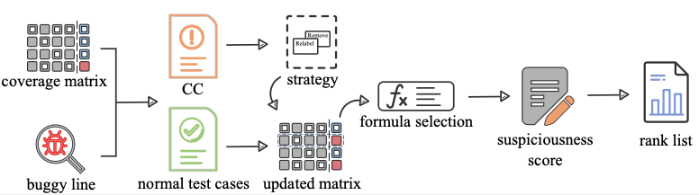

# Octant
A tool for analyzing coincidental correctness test cases and fault localization.
Octant, which analyzes coincidental correctness test cases (CC) for fault localization. The tool automatically collect information about the test cases of a program and the ratio of CC. With OCTANT, researchers can effectively address the impact of CC by relabeling or removing them. Additionally, OCTANT incorporates a supervised random forest-based CC detection approach along with more than ten fault localization techniques for suspiciousness evaluation.

# I.Install

 
  ```pip install requirement.txt```

# II.Overview of Octant


# III.Use in Command-line 

- Parameters

Command-line in python
The list of parameters provided by Octant is as follows.
  
| parameter | description| choice|
| :-------: | :----------------------------------------------------------: | :----------------------------: |
|    -m     |             Specify a coverage matrix file path              |           customize            |
|    -b     |                Specify a buggy line file path                |           customize            |
|    -f     |        Choose formula to compute the suspicious value        | suspiciousness compute formula |
|    -t     |                     Choose cc list type                      |   prediction or  truth   |
|    -d     | Destination path to save the output, default is the matrix input directory |           customize and optional           |


- Methods

| method | discibtion | parameter |
| :----:| :----: | :----: |
| predict | Using an algorithm to predict CC| -m -b |
| ratio | Analyzing CC ratio in passed test cases| -m -b |
| remove | Remove test cases from matrix| -m -t |
| relabel | Change test case label in matrix | -m -t |
| rank | View buggy line rankings and suspiciousness value| -m -b -f|
| sfl | View all statement rankings and suspiciousness value | -m -b -f |


# IV.Octant Usage Example

- Use Octant to analyze the situation of CC in the file.
  You can use this module to analyze the distribution of CC in the file, count the number of successful and failed test cases, and the proportion of CC in successful test cases.


  ```python main.py locate -m ~/Documents/OCTANT/d4j/Time/17/matrix.npz -b ~/Documents/OCTANT/d4j/Time/17/bug_pos.npy```

  
- Use Octant to predict the situation of CC in the file.
  You can use the predict module to predict where CCs are likely to be. Of course, you can also overload this module according to your own method.

  ```python main.py predict -m ~/Documents/OCTANT/d4j/Time/17/matrix.npz -b ~/Documents/OCTANT/d4j/Time/17/bug_pos.npy```

  
- Use Octant to choose the strategy in coverage matrix.
  Select the strategy of CC change and the method of CC line to use. The strategies include  '-remove' and '-relabel'. In the CC line, '-truth' corresponds to the CC analyzed by the buggy line, and '-prediction' uses the predicted CC line.

  ```python main.py remove -m ~/Documents/OCTANT/d4j/Time/17/matrix.npz -b ~/Documents/OCTANT/d4j/Time/17/bug_pos.npy -t truth```

  
- Compute suspiciousness value of buggy line.
  Calculate the suspiciousness value and rank of where the bug is located in the file. You can specify the suspicious value calculation formula to use.
  

  ```python main.py rank -m ~/Documents/OCTANT/d4j/Time/17/matrix.npz -b ~/Documents/OCTANT/d4j/Time/17/bug_pos.npy -f dstar```

  
- Compute suspiciousness value of all statements.
  Calculate suspiciousness and rank for all statements in the file. You can specify the suspicious value calculation formula to use.
  
  ```python main.py sfl -m ~/Documents/OCTANT/d4j/Time/17/matrix.npz -b ~/Documents/OCTANT/d4j/Time/17/bug_pos.npy -f dstar```
